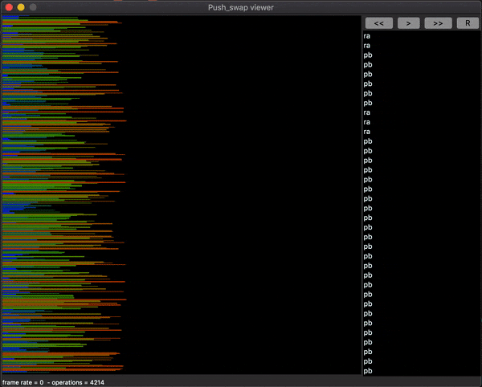

# Sort data on a stack with limited set of instructions
 Write a C program which sorts and displays on the standard output the integers received as arguments.

## We have 2 stacks and a set of instructions to manipulate both stacks.
  - sa (swap a) : swap the 2 first elements at the top of stack A.
  - sb (swap b ) : swap the 2 first elements at the top of stack B.
  - ss : sa et sb at the same time.
  - pa (push a) :  take the  first element at the top of stack b and put at the top of A.
  - pb (push b) :  take the  first element at the top of stack a and put at the top of B.
  - ra (rotate a) : shift up all elements of stack A by 1. the first become last one.
  - rb (rotate b) : shift up all elements of stack B by 1. the first become last one.
  - rr : ra et rb at the same time.
  - rra (reverse rotate a) : shift down all elements of stack A by 1. the last become first one.
  - rrb (reverse rotate b) : shift down all elements of stack B by 1. the last become first one.
  - rrr : rra et rrb at the same time.
    
## Algo used
- We push (pb) in B until there are only three elements left in A. we sorted A by descending order.
- As long as B is not empty, we look for the element of B that will require the least number of instructions to reach A (in the right place). for that :
  - calculate target element from stack A for each B element.
  - calculate the cost value (number of instructions we need to put element at the right place in A).
  - choose the cheapest one.
  - finally move it to the top of stack A.
  - recalculate target element and cost value after each push to stak A.
 - At the end, when stack B is empty,  rotate A to put the smallest element on top.

## Build and start
run
```
make
```
then you can start stack like following

ARG="put number inside double cote"
- to show instructions used
```
ARG="1 5 2 4 3"; ./push_swap $ARG 
```
- to show the numbers of instructions used
```
ARG="1 5 2 4 3"; ./push_swap $ARG | wc -l
```
- to show if the stack is sorted
```
ARG="1 5 2 4 3"; ./push_swap $ARG  | ./checker_linux $ARG
```


Visualizer : [https://github.com/o-reo/push_swap_visualizer](https://github.com/o-reo/push_swap_visualizer)


 
